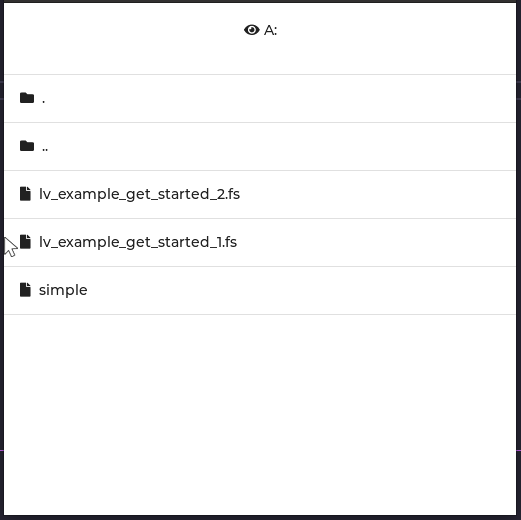
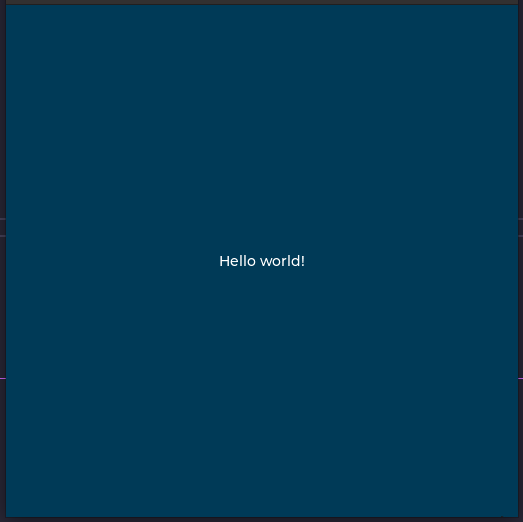

# LVGL with mcp_forth

`gcc-multilib` and `libsdl2-dev:i386` needs to be installed (unless OS is 32 bit) to compile as 32 bit for Forth.

This project leverages an intensive binding generation tool in LVGL.
A JSON of the public LVGL API is generated and then the script
`lvgl_json.jq` generates a binding array for mcp-forth.

```shell
make -C ../../.. all
make runtime_lvgl.c
mkdir build
cd build
cmake -GNinja ..
ninja lvgl_workspace
./lvgl_workspace
```

It reads the files in `../forth_programs/`. Click one to run it.
Programs under the directory called "simple" are simple terminal
output programs. Watch your terminal for the output. The entry
in the LVGL file explorer is just called "simple" and is hard to
recognize as a directory, but it is.




```forth
\ Basic example to create a "Hello world" label

\ Change the active screen's background color
lv_screen_active 0x003a57 lv_color_hex LV_PART_MAIN lv_obj_set_style_bg_color

\ Create a white label, set its text and align it to the center
lv_screen_active lv_label_create
dup s" Hello world!" drop lv_label_set_text
lv_screen_active 0xffffff lv_color_hex LV_PART_MAIN lv_obj_set_style_text_color
dup LV_ALIGN_CENTER 0 0 lv_obj_align

drop     \ drop the label pointer from the stack
```
